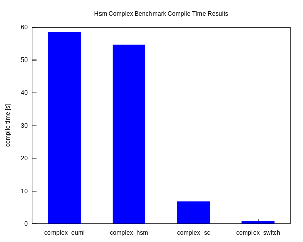

# Hana State Machine (HSM)
[](https://travis-ci.org/erikzenker/hsm) [](https://codecov.io/gh/erikzenker/hsm) [](https://github.com/erikzenker/hsm/blob/master/LICENSE) [](https://GitHub.com/erikzenker/hsm/graphs/contributors/) [](https://GitHub.com/erikzenker/hsm/releases/) [](https://paypal.me/erikzenker) [](https://gitter.im/hsm-gitter/community?utm_source=badge&utm_medium=badge&utm_campaign=pr-badge&utm_content=badge)
=

The **hana state machine** (hsm) is a [finite state machine](https://en.wikipedia.org/wiki/Finite-state_machine) library based on the [boost hana](https://www.boost.org/doc/libs/1_61_0/libs/hana/doc/html/index.html) meta programming library. It follows the principles of the [boost msm](https://www.boost.org/doc/libs/1_64_0/libs/msm/doc/HTML/index.html) and [boost sml](https://boost-experimental.github.io/sml/index.html) libraries, but tries to reduce own complex meta programming code to a minimum.

Currently the following features are supported:
* [Initial pseudo state](test/integration/basic_transitions.cpp)
* [External transitions with guards and actions](test/integration/guards_actions.cpp)
* [Anonymous transitions](test/integration/anonymous_transition.cpp)
* [Submachines](test/integration/basic_transitions.cpp)
* [Entry/exit pseudo states](test/integration/entry_exit_pseudo_states.cpp)
* [History pseudo state](test/integration/history_pseudo_state.cpp)
* [Entry/exit actions](test/integration/entry_exit_actions.cpp)
* [Direct transitions](test/integration/direct_transition.cpp)
* [Orthogonal regions](test/integration/orthogonal_regions.cpp)
* [Internal transitions](test/integration/internal_transition.cpp)
* [Unexpected event handler](test/integration/unexpected_transition_handler.cpp)
* [Dependency injection](test/integration/dependency_injection.cpp)
* [Defer events](test/integration/defer_events.cpp)
* [eUML frontend](test/integration/transition_dsl.cpp)

## Simple Example ([Turnstile](example/turnstile/main.cpp))


```c++
#include "hsm/hsm.h"

#include <cassert>

// States
struct Locked {
};
struct Unlocked {
};

// Events
struct Push {
};
struct Coin {
};

// Guards
const auto noError = [](auto /*event*/, auto /*source*/, auto /*target*/){return true;};

// Actions
const auto beep = [](auto /*event*/, auto /*source*/, auto /*target*/){ std::cout << "beep!" << std::endl;};
const auto blink = [](auto /*event*/, auto /*source*/, auto /*target*/){ std::cout << "blink, blink, blink!" << std::endl;};

struct Turnstile {
    constexpr auto make_transition_table()
    {
        // clang-format off
        return hsm::transition_table(
            // Source               + Event               [Guard]   / Action = Target
            // +--------------------+---------------------+---------+--------+------------------------+
            hsm::state<Locked> {}   + hsm::event<Push> {}           / beep   = hsm::state<Locked> {}  ,
            hsm::state<Locked> {}   + hsm::event<Coin> {} [noError] / blink  = hsm::state<Unlocked> {},
            // +--------------------+---------------------+---------+--------+------------------------+
            hsm::state<Unlocked> {} + hsm::event<Push> {} [noError]          = hsm::state<Locked> {}  ,
            hsm::state<Unlocked> {} + hsm::event<Coin> {}           / blink  = hsm::state<Unlocked> {}
            // +--------------------+---------------------+---------+--------+------------------------+                        
            );
        // clang-format on
    }

    constexpr auto initial_state()
    {
        return hsm::initial(hsm::state<Locked> {});
    }
};

int main()
{
    hsm::sm<Turnstile> turnstileSm;

    // The turnstile is initially locked
    assert(turnstileSm.is(hsm::state<Locked> {}));

    // Inserting a coin unlocks it
    turnstileSm.process_event(Coin {});
    assert(turnstileSm.is(hsm::state<Unlocked> {}));

    // Entering the turnstile will lock it again
    turnstileSm.process_event(Push {});
    assert(turnstileSm.is(hsm::state<Locked> {}));

    return 0;
}
```
## Runtime Benchmark Results
### [Simple Benchmark](benchmark/simple/)
| Events | States | Transitions | Process Events |
|--------|--------|-------------|----------------|
|  6     |   5    |      12     |        1000000 |

| Runtime | Compile Time |
|--|--|
|||


### [Complex Benchmark](benchmark/complex/)
| Events | States | Transitions | Process Events |
|--------|--------|-------------|----------------|
|  50    |   50   |      50     |        1000000 |

| Runtime | Compile Time |
|--|--|
|||

## Dependencies
* Boost 1.72
* C++17

## Create and Install the Package
``` bash
mkdir src/build
cd src/build
cmake .. -DCMAKE_BUILD_TYPE=Release -DCMAKE_INSTALL_PREFIX=/tmp/
cmake --build . --target install
```

## Create and Install the Package with Conan
``` bash
mkdir src/build
cd src/build
conan install ..
cmake .. -DCMAKE_BUILD_TYPE=Release -DCMAKE_INSTALL_PREFIX=/tmp/
cmake --build . --target install
```

## Compile and Run the Tests Using the Installed Library
``` bash
mkdir test/build/
cd test/build/
cmake .. -DCMAkE_BUILD_TYPE=Release -DCMAKE_INSTALL_PREFIX=/tmp/
cmake --build . --target hsmTests
ctest -VV
```

## Author
* erikzenker(at)hotmail.com
